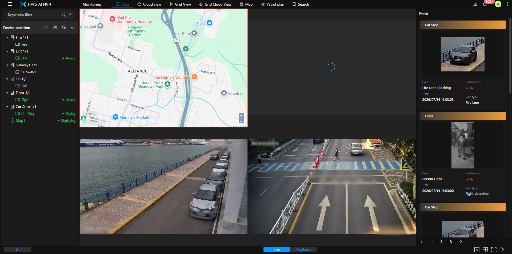
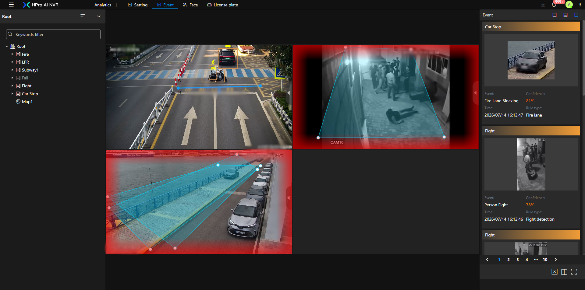
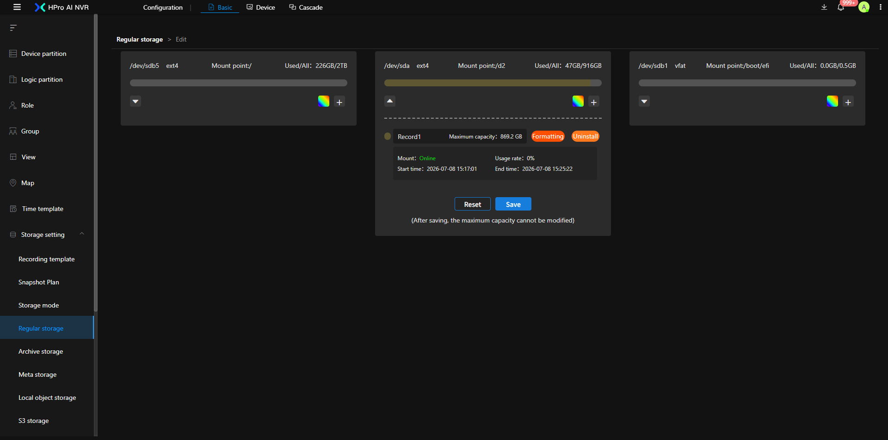
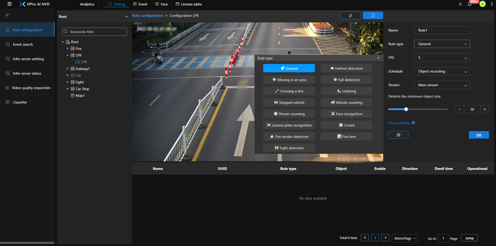
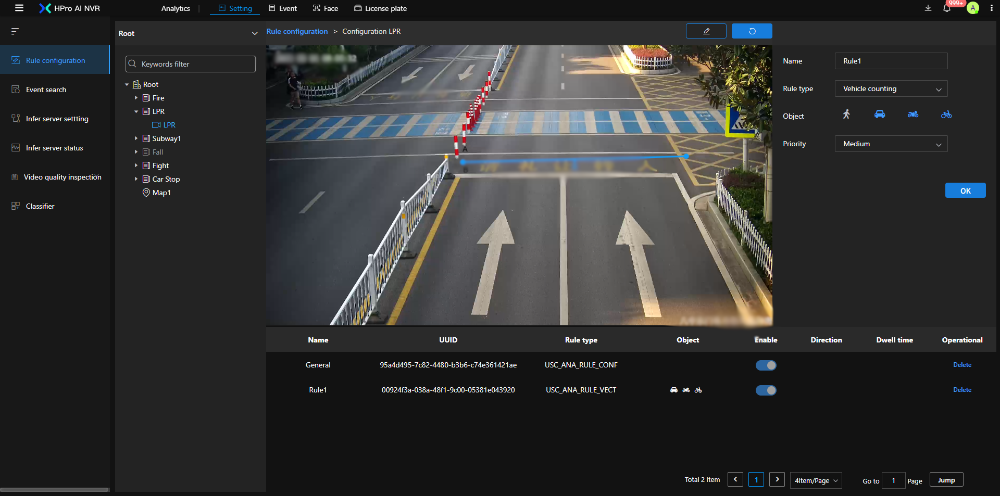
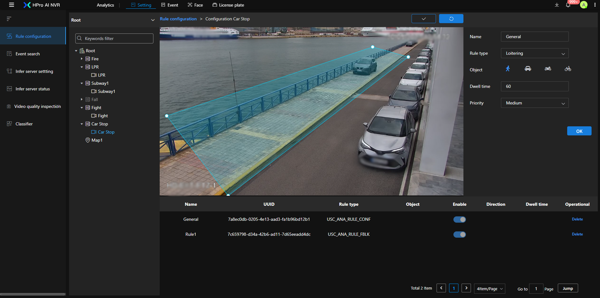

# HPro AI NVR web







Developing with Vue 3 in Vite.

## Node Version
v22.18.0

## Project Setup

```sh
npm install
```

### Compile and Hot-Reload for Development

```sh
npm run dev
```

### Type-Check, Compile and Minify for Production

```sh
npm run build
```
